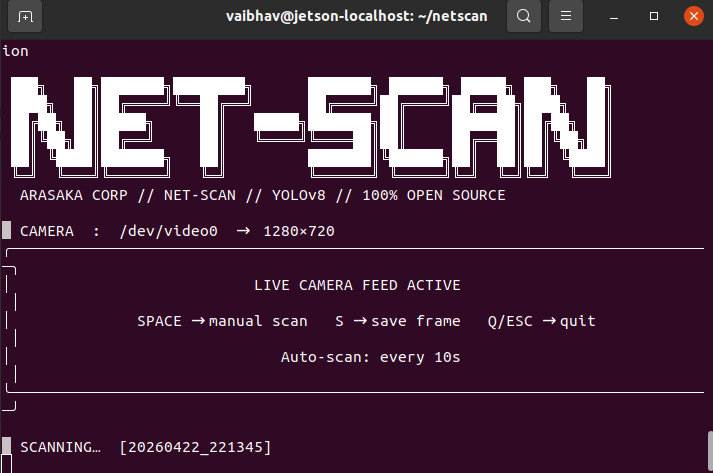

# NET-SCAN — Cyberpunk Anomaly Detection System

> **YOLOv8 + OpenCV · NVIDIA Jetson · 100% Open Source · No API Key Required**

A real-time object anomaly detector with a **Cyberpunk 2077 / Arasaka Corp** aesthetic, built with YOLOv8 and OpenCV. Runs on a Jetson via USB camera inside Docker.

---

## Demo


*Live terminal output showing scan results, threat table, and identified objects*


*Cyberpunk HUD overlay with neon bounding boxes, threat bar, and corner brackets*

---

## Features

- **Real-time object detection** using YOLOv8n (runs on Jetson GPU)
- **Anomaly classification** — knives, scissors, weapons flagged automatically
- **Cyberpunk HUD overlay** — neon bounding boxes, threat bar, scanlines, vignette, rain
- **Live camera window** — lightweight feed + full HUD flashes after each scan
- **Docker containerized** — no dependency conflicts on Jetson
- **100% open source** — no API key, no internet after first run

---

## Tech Stack

| Component | Technology |
|-----------|-----------|
| Object Detection | YOLOv8n (Ultralytics) |
| Computer Vision | OpenCV |
| Terminal UI | Rich |
| Container | Docker + NVIDIA L4T PyTorch |
| Hardware | NVIDIA Jetson + USB Camera |

---

## Project Structure

```
netscan/
├── detector.py       — YOLOv8 pipeline + cyberpunk OpenCV renderer
├── camera.py         — Jetson USB camera live feed + display window
├── demo_output.py    — Generate sample image (no camera needed)
├── requirements.txt  — Python dependencies
├── Dockerfile        — Container build
└── README.md
```

---

## How It Works

```
USB Camera (/dev/video0)
       │
       ▼
 OpenCV VideoCapture (V4L2, 640x480, 30fps)
       │  triggered every N seconds or SPACE
       ▼
 YOLOv8n inference → 80 COCO classes
       │  classify_anomaly() checks each label
       ▼
 render_output() — OpenCV cyberpunk rendering
   ├── scanlines + vignette + color grade
   ├── neon rain overlay
   ├── glow boxes + parallelogram labels + corner brackets
   └── corp HUD + threat bar
       │
       ▼
 Annotated JPG saved + Rich terminal report
```

---

## Anomaly Classes

| Severity | Objects |
|----------|---------|
| CRITICAL | knife, gun, pistol, rifle, fire |
| HIGH | scissors, smoke |
| MEDIUM | cell phone |
| MEDIUM | bear, elephant, zebra (out-of-context animals) |
| Normal | everything else |

---

## Setup

### 1. Clone
```bash
git clone https://github.com/VaibhavAG-02/anamoly_detection
cd netscan-anomaly-detector
```

### 2. Build Docker image
```bash
docker build -t netscan .
```

### 3. Allow display + create output folder
```bash
xhost +local:docker
mkdir -p ~/netscan/output
```

### 4. Run
```bash
docker run --runtime nvidia \
  --device /dev/video0 \
  -e DISPLAY=$DISPLAY \
  -v /tmp/.X11-unix:/tmp/.X11-unix \
  -v ~/netscan/output:/app/netscan_output \
  netscan python3 camera.py live --interval 10 --width 640 --height 480
```

---

## Keyboard Controls

| Key | Action |
|-----|--------|
| SPACE | Trigger scan |
| S | Save raw frame |
| Q / ESC | Quit |

---

## License

MIT

---

*"Your biometrics have been uploaded to Arasaka servers. Have a nice day, choom."*
